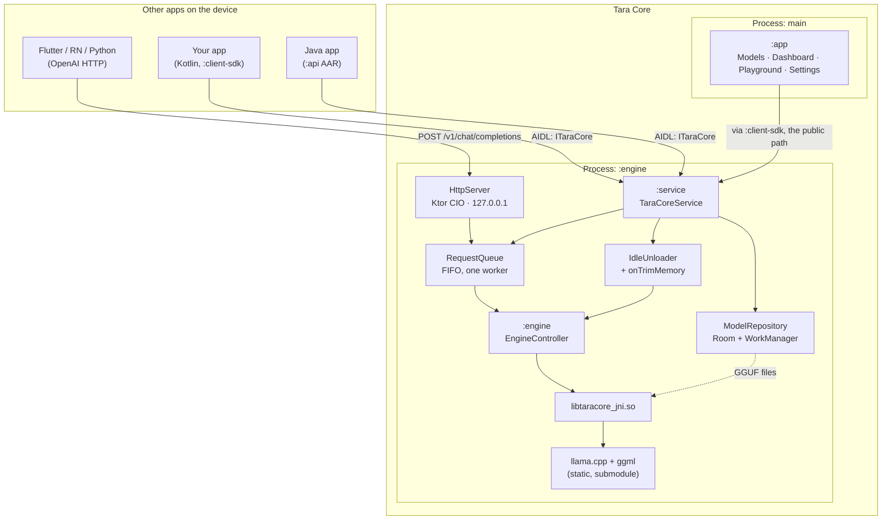

# Tara Core

**One star every app steers by — on-device LLM inference for the whole phone.**

Tara Core runs GGUF language models on Android through `llama.cpp` and lends that
engine to every other app on the device — over a bound AIDL service, or over an
OpenAI-compatible HTTP server on `127.0.0.1`.

One engine. One copy of the weights. Every app takes its bearing from it.

तारा (*tārā*) is Sanskrit for **star**, and names Tārā, the goddess of guidance and
safe crossing. See [docs/BRAND.md](docs/BRAND.md).

---

## Why

Today every Android app that wants a local model ships its own copy of `llama.cpp`
and its own 2 GB of weights. Three such apps mean three engines, three sets of
weights, and three teams solving foreground-service policy, thermal throttling and
quantisation formats independently.

Tara Core is the other arrangement: one system component that holds the model, and a
contract other apps call. Install it once; every app that speaks the contract gets
local inference with no engine of its own and no weights in its APK.

## Architecture



The UI and the engine live in **separate processes**. A native OOM while mapping
several gigabytes takes down the engine, not the interface, and the UI's own heap is
never counted against the model's footprint.

## Install

**Google Play** — *(pending first release)*

**GitHub Releases** — [latest release](https://github.com/weberq/taracore/releases/latest).
Download the `.apk`; it is arm64-only and needs Android 8.0 or newer. Verify it:

```bash
sha256sum -c SHA256SUMS.txt
```

The app checks GitHub once a day for a newer release and offers it on the Dashboard.
That check sends nothing about you — it is an unauthenticated read of a public page,
and it is off automatically for installs from Play. It can be disabled in Settings.

## Quick start

```bash
git clone --recurse-submodules <repo-url> tara-core
cd tara-core
./gradlew assembleCpuDebug
./gradlew :app:installCpuDebug
```

Open Tara Core, pick a model on the **Models** tab, tap **Set active**, and ask it
something on **Playground**. Full toolchain requirements are in
[docs/SETUP.md](docs/SETUP.md).

## Integrating, in three lines

```kotlin
val client = TaraCoreClient(context).apply { connect() }
client.chatStream(listOf(ChatMessageParcel("user", "Hello")))
      .collect { piece -> print(piece) }
```

Plus one line in your manifest:

```xml
<uses-permission android:name="dev.taracore.permission.BIND_INFERENCE" />
```

Java, Flutter and `curl` equivalents are in
[docs/INTEGRATION.md](docs/INTEGRATION.md).

Or skip the SDK entirely and point an OpenAI client at the loopback server:

```python
from openai import OpenAI
client = OpenAI(base_url="http://127.0.0.1:8080/v1", api_key="<token from Settings>")
```

## Security model

Three independent controls, because none of them is sufficient alone:

**A custom permission.** `dev.taracore.permission.BIND_INFERENCE`, `protectionLevel`
`normal`, granted at install time and visible on the app's details page. It gates
`bindService`, and the service re-checks it inside every method — a client can pass
its live binder to a third app, and we do not want to honour that silently.

**Loopback only.** The HTTP server binds `127.0.0.1` and rejects any non-loopback
remote address before routing. It never listens on a network interface.

**A quiet foreground service.** Android will not run a foreground service without a
notification, so Tara Core is only foreground while it is actually working — loading
a model, answering a request, or running the HTTP server. The rest of the time it is
a plain bound service with no notification at all. The notification it does show sits
on a `MIN`-importance channel, so it is silent and keeps out of the status bar. A
permanent, more detailed one is available in Settings for anyone who wants it, and
there is a home screen widget as a quieter alternative.

**A bearer token.** On by default, 32 random bytes generated on first run, compared
in constant time. This is the control that actually matters for HTTP: *any* app on
Android can open a socket to `127.0.0.1` holding no permission at all, so the bind
address is not a boundary. The token is.

Beyond that: nothing leaves the device. Tara Core makes exactly one kind of outbound
request — downloading a model you asked for. No prompt, no completion, and no
telemetry is ever sent anywhere.

## Constrained output

Small models are only useful for structured tasks if their output can be *guaranteed*
structured. `response_format` compiles to a grammar that makes every other token
unsamplable:

```bash
curl -s -H "Authorization: Bearer $TOKEN" -H 'Content-Type: application/json' \
  -d '{"messages":[{"role":"user","content":"Merchant: Uber. Which category? Answer with one option only."}],
       "response_format":{"type":"choice","choices":["Food","Transport","Entertainment"]}}' \
  http://127.0.0.1:8080/v1/chat/completions
```
→ `Transport`, every time. Also `json_object`, `json_schema`, and raw GBNF. From
Kotlin it is `ChatParams(grammar = Constraint.oneOf("Food", "Transport", ...))`.

### What a grammar does not give you

A choice grammar guarantees the answer is one of your options. **It does not guarantee
the model considered them.** Including an explicit "none of these" option does not
reliably give the model an exit — small models rarely take it. If a wrong answer costs
more than no answer, keep a non-model path for the confident cases and treat the
constrained reply as a suggestion.

This is not hypothetical. Categorising merchants from real payment notifications, with
six categories plus `"None of these"` in the choice set every time:

| | correct |
|---|---|
| keyword list alone | 17/19 |
| keywords + constrained `qwen2.5-1.5b` | 12/19 |
| keywords + constrained `qwen2.5-0.5b` | 10/19 |

Constraining the output made the outcomes *worse*. Not because the grammar
misbehaved, but because it removed an accident that had been doing useful work: an
unparseable answer used to mean "no category", and that silence was usually right. A
constrained model always commits, and it commits confidently to nonsense —
`qwen2.5-0.5b` answered `Shopping` for every unrecognised merchant, including three
people's names. The 1.5B chose `"None of these"` once in eight; the 0.5B never chose
it at all.

The shape that worked: a deterministic path decides the cases it is sure about, and
the model's constrained answer only *pre-fills* a suggestion for a human to confirm.
Constrained decoding is what makes that suggestion clean enough to show someone —
just do not read a valid answer as a considered one.

*(Measured by the Cashi Flow integration; see issue #1.)*

## Roadmap

- **Multi-sequence batching** — several clients sharing one context through
  `n_seq_max > 1`, instead of queueing. The largest available throughput win.
- **`/v1/embeddings`** — the pooling paths already exist in `llama.cpp`; this is
  mostly an endpoint and a context flag.
- **Tool calling** — `tools` / `tool_choice` on the chat endpoint, building on the
  constrained decoding that already landed.
- **LoRA adapters** — `llama_adapter_lora` lets one base model serve several
  fine-tunes at a few megabytes each, rather than a full model per task.
- **Batch warm-up policy** — `warmUp` currently decides per call; a service-wide
  policy could also defer while on battery or thermally throttled.
- **Confidence signals** — `logprobs` on the response, so a client can tell a
  considered answer from a coerced one and fall back rather than commit. The gap the
  table above measures is the argument for it.
- **LiteRT backend** — an alternative to `llama.cpp` reaching the NPU on devices that
  expose one, where the gap over CPU is an order of magnitude rather than a factor.

## Licence

Apache-2.0. `llama.cpp` is MIT; see [THIRD_PARTY_NOTICES.md](THIRD_PARTY_NOTICES.md).

Tara Core ships **no model weights**. Models are downloaded at the user's request and
carry their own licences — Apache-2.0, MIT, the Gemma Terms of Use, the Llama 3.2
Community License — recorded per entry in the catalog and shown in the UI. Those
agreements are between the user and the model's publisher.
