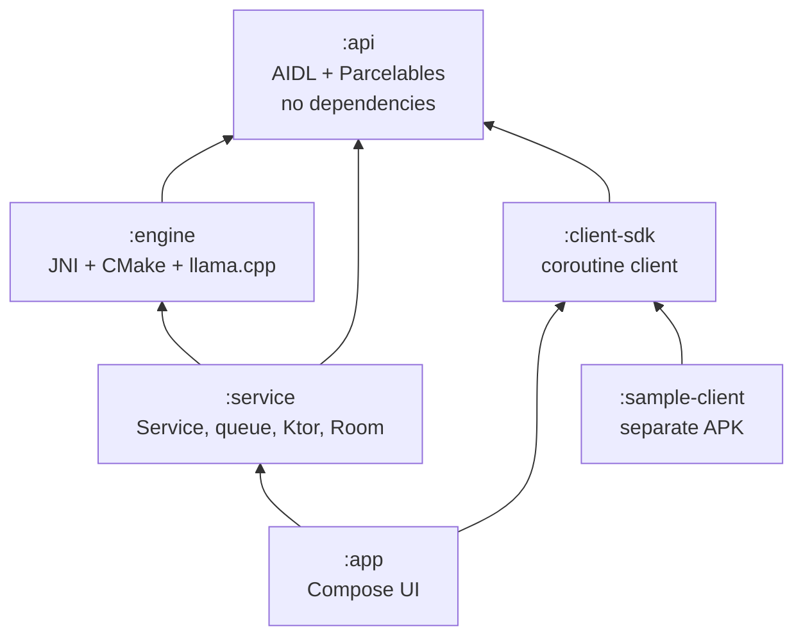

# Architecture

## Module graph



Two things about this graph are load-bearing:

**`:api` depends on nothing.** Not AndroidX, not coroutines, not `:engine`. A
third-party app takes the contract without inheriting a single version constraint
from us. It is also the module with the strictest change policy — see the
compatibility section of [API.md](API.md).

**`:app` depends on `:client-sdk`, not only `:service`.** The Playground could reach
into `:service` directly and save a Binder hop. It deliberately does not: the
integration path other apps use is the one we exercise on every run, so a regression
in the public API breaks our own UI before it reaches anyone else.

`:sample-client` depends on `:client-sdk` alone. It has no compile-time access to
`:service` or `:engine` — a third-party app in every sense but the repository it
lives in.

---

## Process model

```
┌─ process: dev.taracore ────────┐   ┌─ process: dev.taracore:engine ──┐
│  MainActivity                  │   │  TaraCoreService                │
│  MainViewModel                 │◄──┤  RequestQueue                   │
│  Compose UI                    │   │  IdleUnloader                   │
│                                │   │  HttpServer (Ktor CIO)          │
│  heap: tens of MB              │   │  ModelRepository                │
└────────────────────────────────┘   │  EngineController               │
                 ▲                   │  libtaracore_jni.so             │
                 │                   │  llama.cpp + ggml               │
                 └── Binder ─────────┤                                 │
                                     │  heap: model size + KV cache    │
                                     └─────────────────────────────────┘
```

`android:process=":engine"` on the service. The reasons, in order of weight:

1. **Failure isolation.** Loading a 5 GB model on a device with 6 GB of RAM can be
   killed by the kernel OOM killer. In one process that takes the UI with it, and the
   user sees the app vanish. Split, the UI survives and can say what happened.
2. **Honest accounting.** `Debug.getNativeHeapAllocatedSize()` in the UI process
   reports the UI's footprint. Merged, the model's gigabytes would swamp it and no UI
   memory regression would ever be visible again.
3. **Independent lifetime.** The user swipes the app away from Recents; the activity
   process can go, and the engine — with clients bound — stays.

The cost is that every UI-to-service call crosses Binder, including the once-a-second
status poll. At one small transaction per second this is not measurable.

The other cost is real and caught us: **anything the two processes share must be
explicitly multi-process safe.** Settings were originally Preferences DataStore, which
is not — each process gets its own instance and its own cache, so the UI's writes were
invisible to the engine. Toggling the HTTP server did nothing, and nothing logged an
error. Settings now use `MultiProcessDataStoreFactory`, which coordinates through a
file lock and a shared counter. Room is safe across processes already. See
docs/DECISIONS.md D10.

---

## Threading model

```
Binder thread pool (16)     ─── ITaraCore.Stub methods
                                 │  enforcePermission, validate, then hand off
                                 ▼
scope: SupervisorJob +       ─── suspending service work
       Dispatchers.Default        │
                                  ▼
RequestQueue worker (1)      ─── one coroutine, FIFO
                                  │
                                  ▼
taracore-engine thread (1)   ─── EVERY native call, without exception
                                  │
                                  ▼
ggml worker threads (n)      ─── spawned inside llama.cpp for matmul
```

**Rule 1: every native call runs on `taracore-engine`.** A `llama_context` is not
re-entrant and keeps state that assumes a single caller. One dedicated thread makes
that free rather than a discipline someone has to remember. The thread is *named* so
a stuck generation is identifiable in an ANR trace — the most likely cause of one in
this app.

**Rule 2: one generation at a time**, enforced by a `Mutex` inside
`EngineController`. Concurrent clients queue in `RequestQueue` rather than piling up
inside the mutex, where none of them could be cancelled or told its position.

**Rule 3: cancellation must not queue behind the thing it cancels.** This is subtle
and it was a real bug. `EngineController.stream` is a `callbackFlow` whose builder
runs in the *collector's* context, with only the generation dispatched to the engine
thread. If the builder ran on the engine thread too, `awaitClose` would be queued
behind the blocking native call, and a cancel could not be delivered until generation
had already finished. `nativeCancel` only flips an atomic, so it is safe — and
necessary — to call it from a different thread than the one blocked inside
`nativeGenerate`.

**Rule 4: never hold the engine mutex while calling into Java.** The JNI layer
invokes the token listener from inside the sampling loop, but the final `onDone` is
emitted from Kotlin after `nativeGenerate` has returned and the mutex is released.
A client that calls back into the engine from `onDone` therefore cannot deadlock.

---

## Memory model

### Where the bytes are

| | Mapped? | Freed by | Typical, 3B Q4_K_M |
|---|---|---|---|
| Weights | `mmap`, file-backed | `llama_model_free` | ~1.9 GB |
| KV cache | anonymous | `llama_free` | ~200 MB at 4096 ctx |
| Compute buffers | anonymous | `llama_free` | ~100 MB |
| Tokenizer + vocab | heap | `llama_model_free` | a few MB |

Weights are `mmap`'d by default (`LLAMA_LOAD_MODE_MMAP`). They are file-backed and
clean, so the kernel can evict them under pressure and read them back from storage —
the model costs *address space* rather than committed memory, and the resident set
shrinks on its own when something else needs the RAM. `mlock` is available in
Settings and turns that off: faster and steadier, at the cost of taking the memory
away from everything else on the device.

The KV cache is anonymous memory and cannot be evicted. It grows linearly with the
context size, which is why the Settings screen says plainly that doubling the context
roughly doubles what the model costs beyond its weights.

### The three ways a model gets unloaded

1. **Idle timer** (`IdleUnloader`, 5 minutes by default). Every request resets it.
   On expiry the model is freed and, if the HTTP server is off, the service leaves
   the foreground while staying alive for bound clients.
2. **Memory pressure** (`onTrimMemory` at `TRIM_MEMORY_RUNNING_CRITICAL` or above).
   Immediate, no grace period, and flagged in `ServiceStatus` so the dashboard can
   explain why the model went away. The alternative to giving memory back here is
   being killed, which loses the queue as well as the model.
3. **Explicit** — `unloadModel()`, or the notification's Stop action.

Reloading is lazy and reported as progress. Being wrong about idleness costs a few
seconds on the next request; being wrong about memory pressure costs the process.

`START_STICKY` brings the service back after a kill — with **no model loaded**.
Reloading several gigabytes unprompted, immediately after the system said memory was
tight, would be perverse.

---

## Binder size limits

The transaction buffer is **1 MB per process, shared across every transaction in
flight** — not per call. A large parcel can therefore fail because of traffic that
has nothing to do with the request that failed, which makes the symptom maddening to
diagnose in the field.

So: anything above **512 KB** (`INLINE_PROMPT_LIMIT_BYTES`, half the budget) travels
out of band. The client writes the UTF-8 prompt into a pipe and passes the read end
as `GenerationRequest.largePrompt`; `describeContents` returns
`CONTENTS_FILE_DESCRIPTOR` so Binder dups the descriptor instead of copying bytes.
The service reads it to EOF on a worker thread and treats the result as a
pre-rendered prompt.

`:client-sdk` makes this switch automatically, on a dedicated short-lived thread
rather than a `Dispatchers.IO` slot — the write blocks on the pipe's 64 KB buffer
until the service drains it, which can be an unbounded wait.

Streaming has no such limit in practice: each `onToken` carries one token, and it is
`oneway`, so the service never blocks its sampling loop on a slow client.

---

## Foreground service type

`foregroundServiceType="specialUse"`, with

```xml
<property android:name="android.app.PROPERTY_SPECIAL_USE_FGS_SUBTYPE"
          android:value="on-device LLM inference server for other apps" />
```

None of the defined FGS types describes what this does. `dataSync` is for transfers
that finish. `mediaPlayback`, `location`, `camera`, `microphone`, `phoneCall`,
`health` are about specific hardware or user-visible activities. `shortService` is
capped at three minutes — shorter than a single generation on a large model.

`specialUse` is the honest answer, and declaring a type that does not fit in order to
avoid it would be worse.

### Play policy note

`specialUse` requires a written justification in Play Console, reviewed manually.
Ours is:

> Tara Core hosts a large language model in memory and serves inference requests from
> other applications on the device through a bound AIDL service and a loopback HTTP
> server. The work is initiated by a user of another app, continues while that app is
> in the foreground and Tara Core is not, and takes from seconds to minutes per
> request. The model is unloaded and the foreground state released as soon as the
> device goes idle. No existing foreground service type describes hosting a shared
> inference engine for other applications.

Expect review friction. The mitigations that make the case defensible are already in
the code and visible to a reviewer: the service leaves the foreground the moment
nothing is resident, the notification names the model and offers a Stop, and the idle
timeout is on by default rather than opt-in.

---

## The permission, and why `normal`

`dev.taracore.permission.BIND_INFERENCE`, `protectionLevel="normal"`.

- `signature` would restrict Tara Core to apps signed with our key. That defeats the
  entire premise of a device-wide shared engine.
- `dangerous` would demand a runtime prompt, and there is no system-supplied wording
  that would make sense to a user for "may use the on-device model".
- `normal` is granted at install time and listed on the app's details page.

The risk being gated is **compute and battery**, not access to the user's data: Tara
Core holds no user data to leak. An app that abuses the engine drains the battery, and
that is visible in the notification, in the dashboard's per-client usage, and in the
system battery attribution.

Defence in depth: the manifest's `android:permission` gates `bindService`, and every
`Stub` method re-checks with `checkCallingOrSelfPermission`. An app **can** legitimately
hand a live binder to another app, and we do not want to honour that silently.

---

## Native build

One shared library, `libtaracore_jni.so`, with `llama` and `ggml` linked **statically**
into it. One artifact to ship, and `-Wl,--gc-sections` can then drop everything we
never call.

**16 KB page compliance.** Android 15+ devices may boot with a 16 KB page size, and a
library whose `LOAD` segments are 4 KB-aligned simply will not load there. Every link
line carries `-Wl,-z,max-page-size=16384`, `useLegacyPackaging = false` keeps the `.so`
uncompressed and page-aligned in the APK, and CI asserts that every `LOAD` segment
reports `0x4000`. The failure mode this prevents is invisible until you hold the
affected hardware.

**ABI.** `arm64-v8a` only, with `x86_64` added back by the `debug` build type so the
emulator works. A release APK never carries an x86 slice no phone can execute.

**CPU features.** `GGML_CPU_ARM_ARCH=armv8.2-a+dotprod+fp16`, probed with
`check_cxx_compiler_flag` and falling back to `armv8-a` if the toolchain rejects it.
Dotprod roughly doubles Q4_K throughput and every arm64 SoC since about 2018 has it,
but an older NDK produces a working slower build rather than a failure.

**`GGML_NATIVE=OFF`** — mandatory when cross-compiling. Left on, ggml probes the
*host* CPU and emits x86 flags into an arm64 build.

**OpenMP off.** The NDK ships no `libomp` we can link statically without dragging
`libomp.so` into the APK; ggml's own threadpool is used instead.
